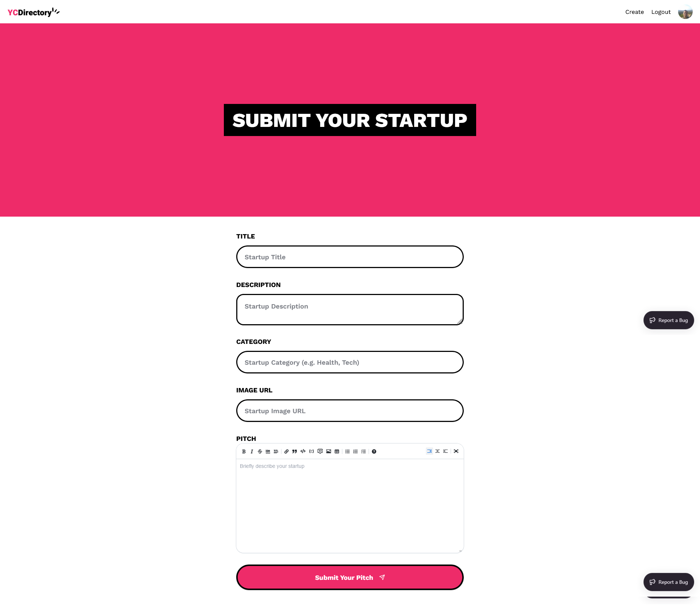
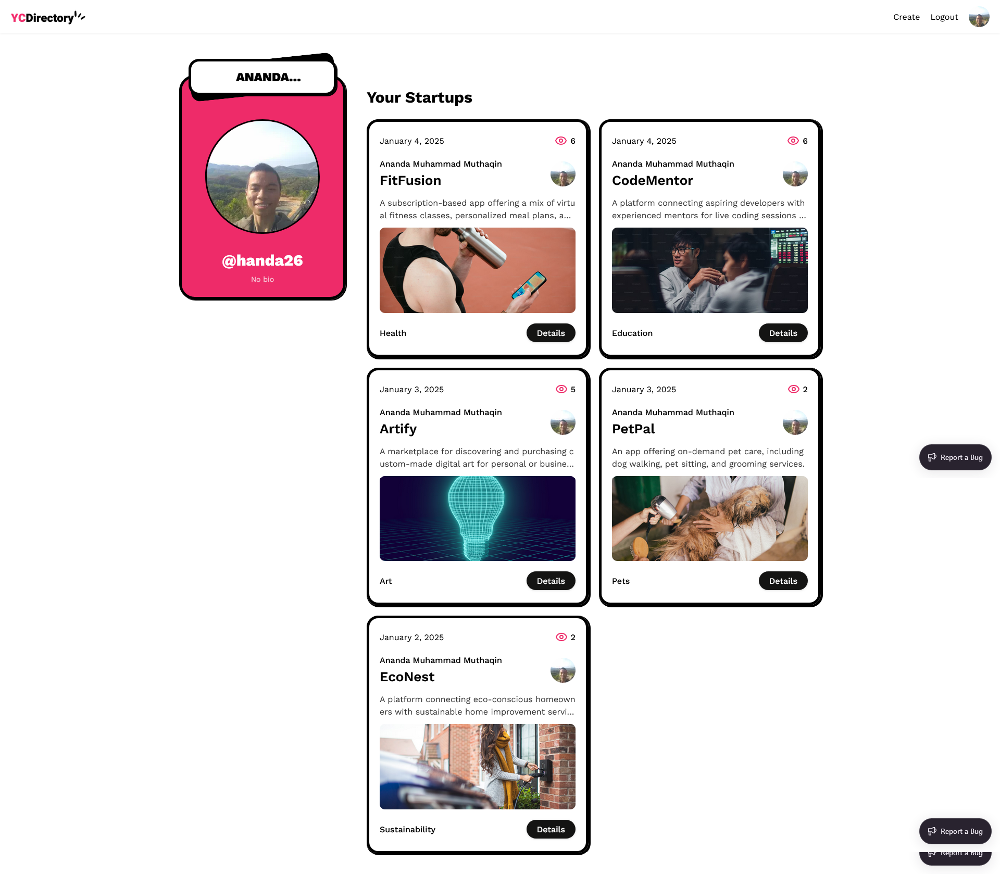

# YC Directory

YC Directory is a web application that allows users to pitch their startup ideas. Users can create, search, and explore startups.

<div>
    
    
    
    
</div>

## Features
- **User Authentication**: Login via GitHub for seamless access.
- **Create and Manage Pitches**: Submit startup ideas with detailed information, including title, description, category, and image URL.
- **Search Functionality**: Easily find startups by searching through the directory.
- **Startup Directory**: Explore a growing collection of startups with options to view and interact.
- **Bug Reporting**: Users can report issues directly via the integrated bug-tracking feature.

## Tech Stack

- **Framework**: [Next.js 15](https://nextjs.org/)
- **Styling**: [Tailwind CSS](https://tailwindcss.com/)
- **UI Components**: [Shadcn](https://shadcn.dev/)
- **Content Management**: [Sanity.io](https://www.sanity.io/)
- **Bug Tracking**: [Sentry](https://sentry.io/)

## Screenshots

### Homepage
<a href="https://yc-directory-blush-seven.vercel.app/">
  
</a>

### Pitch Creation Form
<a href="https://yc-directory-blush-seven.vercel.app/">
  
</a>

### Profile page
<a href="https://yc-directory-blush-seven.vercel.app/">
  
</a>

## Getting Started

### Prerequisites

- Node.js (v16+)
- Git
- Sanity CLI
- GitHub account (for OAuth)

### Installation

1. Clone the repository:

```bash
   git clone https://github.com/yourusername/yc-directory.git
```

2. Navigate to the project directory:

```bash
   cd yc_directory
```

3. Install dependencies:

```bash
   npm install
```

4. Set up Sanity:
- Navigate to the sanity directory:
```bash
   cd sanity
```
- Deploy the content schema:
```bash
   sanity deploy
```

5. Set up environment variables:
```bash
  AUTH_SECRET= # Added by `npx auth`. Read more: https://cli.authjs.dev
  AUTH_GITHUB_ID=
  NEXT_PUBLIC_SANITY_PROJECT_ID=
  NEXT_PUBLIC_SANITY_DATASET="production"
  SANITY_WRITE_TOKEN=
```

6. Run the development server:

```bash
   npm run dev
```